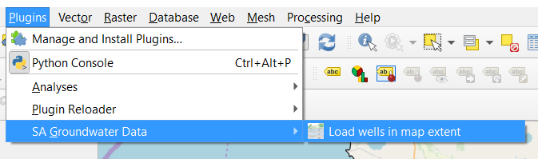
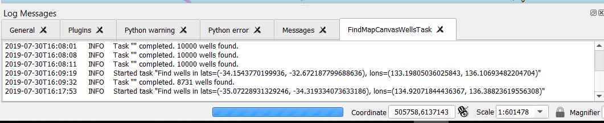
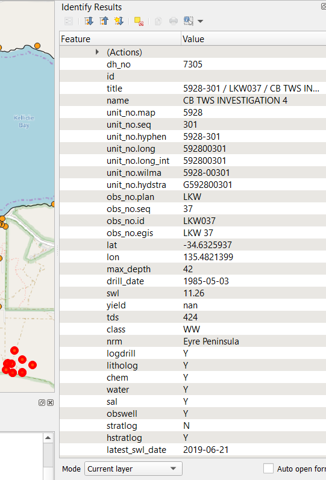
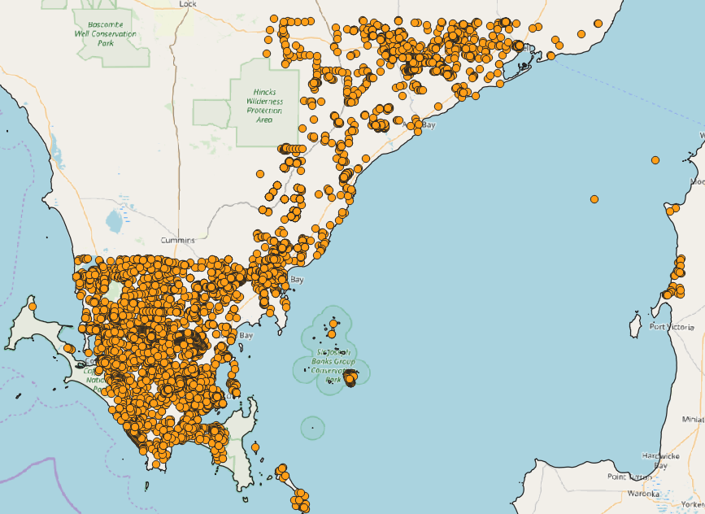

# sa-gwdata-qgis

QGIS 3+ plugin for using SA groundwater data from WaterConnect.
    
This plugin is very experimental. Use it at your own risk. It should work
on QGIS 3+, on Windows, when the bundled Python is version 3.7 and 64-bit.
BEWARE! It will use your QGIS Python's pip to install the following packages
into your QGIS Python installation:

- requests
- pandas v0.25.0
- [python-sa-gwdata](https://github.com/kinverarity1/python-sa-gwdata) master from GitHub

## Usage

The functions are in the Plugins menu. For example, load all the wells in the map's current extent:

Some time-consuming operations, like finding thousands of wells, are done as a background task to prevent QGIS locking up:

You can then use the Identify tool on the "wells" layer:

And if you need more wells, shift the map to a new extent and click the load wells menu item again. It will download the extra wells.

