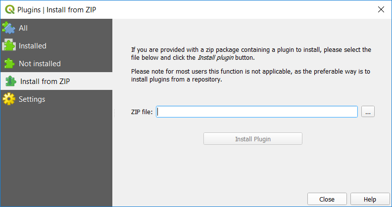

# SA Groundwater Data QGIS plugin

QGIS 3+ plugin for using South Australian groundwater data from WaterConnect.
    
This plugin is experimental. Use it at your own risk. It should work
on QGIS 3+, on Windows, when the bundled Python is version 3.7 and 64-bit.
**BEWARE!** It will use your QGIS Python's pip to install the following packages
into your QGIS Python installation:

- pandas v0.25.0
- requests
- seaborn
- [python-sa-gwdata](https://github.com/kinverarity1/python-sa-gwdata) master from GitHub

## Usage

The plugin goes under the Plugins > SA Groundwater Data menu and currently has four options:

1. Load wells in map extent (F8)
2. Chart water levels for selected wells (F9)
3. Chart bulk salinity sample data for selected wells (F10)
4. Load selected wells in Groundwater Data [in your web browser] (F12)

You can always shift the map extent and re-load the additional wells with F8.

More to come!

## Install

Download the [latest release](https://github.com/kinverarity1/sa-gwdata-qgis/releases) as a ZIP file.
Then go to QGIS > Plugins > Manage and Install Plugins... and select the "Install from ZIP" option:

## License

MIT
